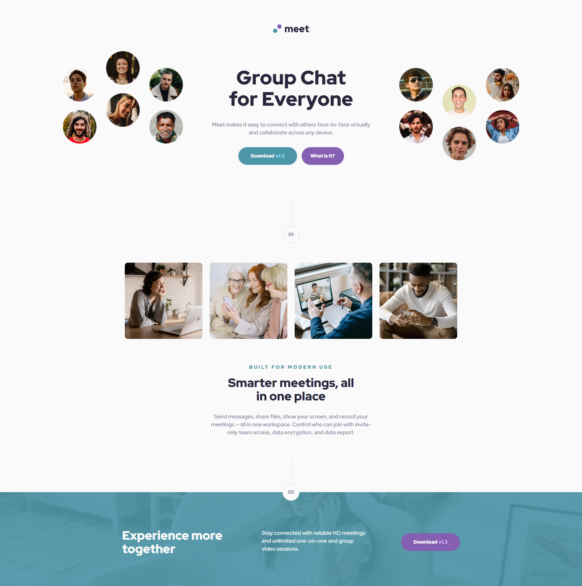
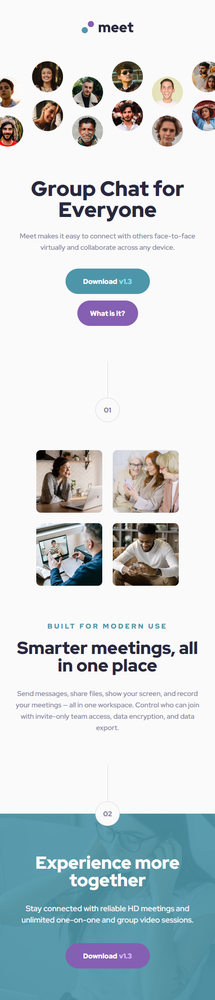

# Frontend Mentor - Meet landing page

## Welcome! 👋

This is a PREMIUM challenge from <a href="https://www.frontendmentor.io/challenges/meet-landing-page-rbTDS6OUR">FrontendMentor Meet landing page challenge</a>. Frontend Mentor challenges help me improve your coding skills by building realistic projects.

## Table of contents

- [Overview](#overview)
  - [The challenge](#the-challenge)
  - [Screenshot](#screenshot)
  - [Links](#links)
- [Author](#author)

## Overview

### The challenge

My task was to build out the landing page and get it looking as close to the design as possible.
I was able to use any tools I liked to help me complete this challenge.

### Screenshot

### Desktop design 💻

### Mobile design 📱

### Links

- Solution URL: [https://github.com/pettik/FrontendMentor--meet-landing-page](https://github.com/pettik/FrontendMentor--meet-landing-page)
- Live Site URL: ➡ [https://pettik-meet-landing-page.netlify.app/](https://pettik-meet-landing-page.netlify.app/) ⬅

## Author

- Website - [Petr Bednarski](https://github.com/pettik)
- Frontend Mentor - [@pettik](https://www.frontendmentor.io/profile/pettik)
